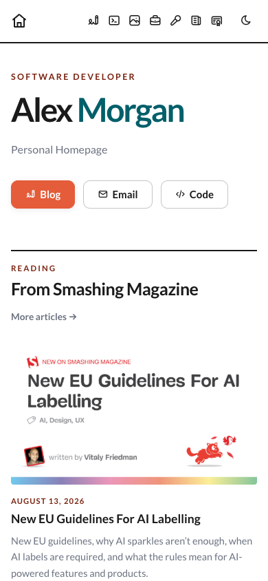
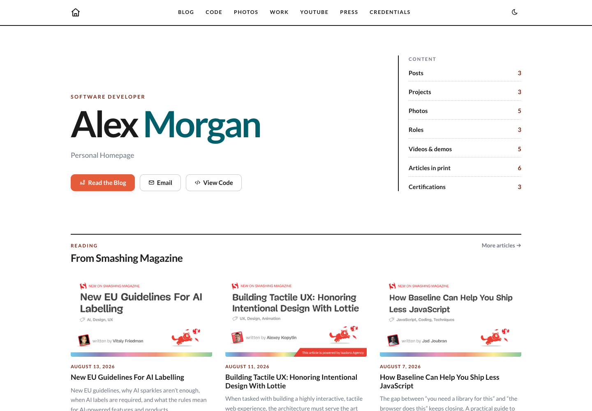
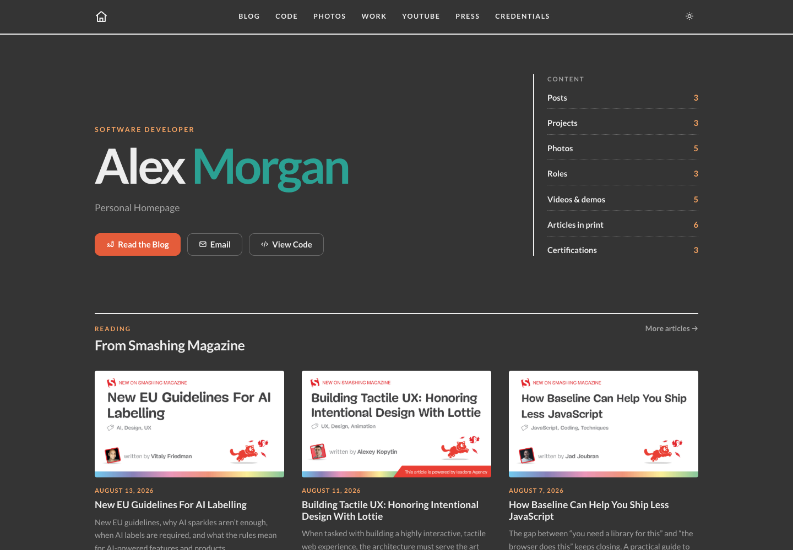

# SiteKit

SiteKit is a small, modular starting point for a personal website. Pick the sections that feel like you, add your own words and images, and generate a fast static site you can host almost anywhere.

| Mobile                                                                   | Light                                                                   | Dark                                                                  |
|--------------------------------------------------------------------------|-------------------------------------------------------------------------|-----------------------------------------------------------------------|
|  |  |  | 

There is no framework or server to maintain after generation—just an `index.html` file and its `assets/` folder.

## Make it yours

1. Add your name, tagline, description, and real website URL to `site.config.json`.
2. Choose your sections and arrange them in `modules.order`.
3. Replace the sample content in each section's `modules/<name>/content.json`.
4. Put that section's images and downloads in its `assets/` folder.

Removing a name from `modules.order` hides that section. Moving a name changes its position on the page, in the navigation, and in the hero index.

## See it locally

You need Node.js 20 or newer.

```bash
npm install
npm run check
npm run generate
```

Open `index.html` in your browser. When you publish, upload both `index.html` and the generated root `assets/` folder.

## Choose your sections

- [Blog](./modules/blog/README.md) — share recent writing from an Atom or RSS feed.
- [Git Contributions](./modules/git-contributions/README.md) — bring projects, public activity, and gists together.
- [Photo Album](./modules/photo-album/README.md) — make a responsive Polaroid-style photo wall.
- [Job History](./modules/job-history/README.md) — tell your career story as a timeline.
- [YouTube](./modules/youtube/README.md) — collect videos, talks, demos, and related links.
- [Press](./modules/press/README.md) — display publications, downloads, and tutorials.
- [Learning](./modules/learning/README.md) — show certifications, courses, and achievements.

The header, introduction, footer, metadata, fonts, and icons come automatically.

## Themes and finishing touches

Choose the `default` or `asplanned` theme in `site.config.json`. Dark mode follows the visitor's system preference, can be changed from the header, and remembers their choice.

Optional finishing touches live under `extensions`:

```json
{
  "extensions": {
    "dark-mode": true,
    "og-meta": true,
    "favicon": true,
    "app-icon": true
  }
}
```

- `dark-mode` adds the light/dark switch when the chosen theme supports it.
- `og-meta` creates a social-sharing image. Set a real `seo.canonicalUrl` before publishing, or use `seo.ogImage` for your own image.
- `favicon` and `app-icon` create browser and home-screen artwork. Replace their 1024×1024 source images, then generate again.

## A little more detail

Blog and contribution sources are fetched while SiteKit generates the page, so visitors do not have to wait for them. If a source is unavailable, SiteKit keeps going and uses the saved content in that module's `content.json`. Leave a source URL empty when you prefer fully authored content.

The most useful commands are:

```bash
npm run check              # check configuration, content, and assets
npm test                   # run the test suite
npm run generate           # rebuild the site
npm run docs:screenshots   # refresh the README screenshots
```

The root `index.html` and `assets/` directory are generated files. Make changes in `site.config.json` and the module folders instead of editing generated output by hand.

Want to build or adapt a module? The public contract, schemas, asset rules, and data lifecycle are in [Architecture and module authoring](./docs/architecture.md).

SiteKit is under active development and licensed under GPL-2.0.
