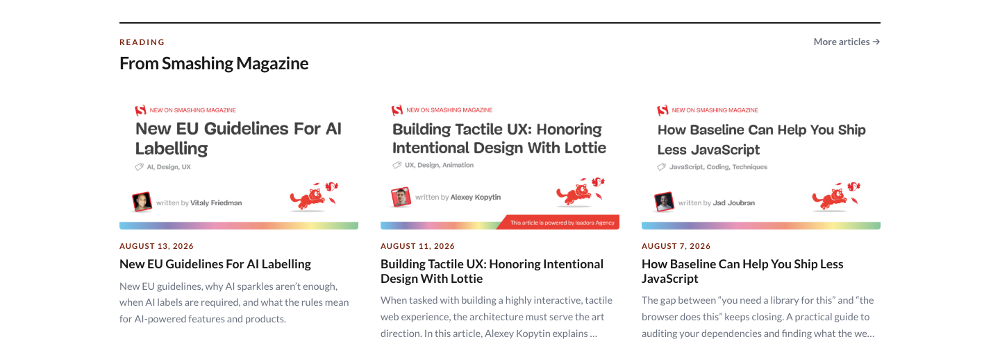

# Blog module



Bring your latest writing onto your homepage. SiteKit reads an Atom or RSS feed when it generates the page and keeps a few saved posts ready in case the feed cannot be reached.

## Add it to your site

Add `blog` to `modules.order` in `site.config.json`, then edit `modules/blog/content.json`:

```json
{
  "eyebrow": "Reading",
  "heading": "From the blog",
  "archiveLabel": "More articles →",
  "archiveUrl": "/blog/",
  "source": { "url": "/blog/feed", "limit": 3 },
  "fallbackNotice": "The live feed is unavailable, so these saved articles are shown instead.",
  "fallback": [
    {
      "title": "A saved post",
      "url": "/blog/a-saved-post",
      "date": "August 1, 2026",
      "excerpt": "A short introduction that still appears when the feed is unavailable.",
      "image": "https://images.example.com/post.webp"
    }
  ]
}
```

The feed can contain up to 12 visible posts. Saved posts need a title, URL, and excerpt; the date, image, and icon are optional.

## Good to know

- A same-site feed such as `/blog/feed` is the easiest choice.
- A feed on another domain must allow your website through CORS if you want the browser to refresh it after the page loads.
- When a browser refresh fails, the posts already included during generation stay in place.
- Relative feed URLs use `seo.canonicalUrl` during generation, so set that to your real website before publishing.
- Cards use three columns on wide screens and one column below 760px. Dark mode follows the rest of SiteKit.

## Configuration reference

| Field | What it changes |
| --- | --- |
| `archiveLabel` / `archiveUrl` | Optional link to the rest of your writing. |
| `source.url` | Atom or RSS 2.0 feed, either absolute or site-relative. |
| `source.limit` | Number of posts shown, from 1 to 12. |
| `fallbackNotice` | Message shown when saved posts are being used. |
| `fallback` | Posts kept as a dependable fallback. |
| `countOverride` | Optional text or number for the hero index. |

Feed dates currently use the `en-US` locale, remote images stay on their original host, and JSON Feed is not supported.
