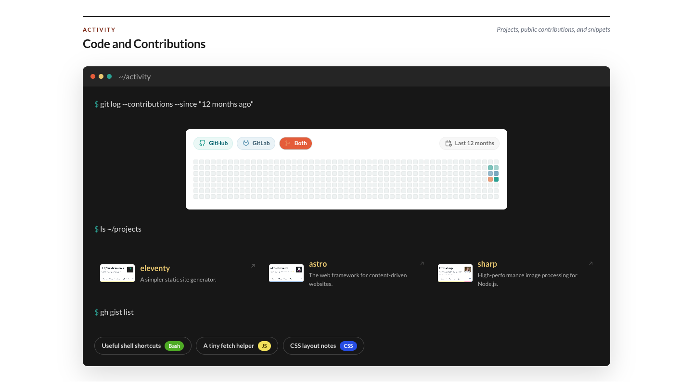

# Git Contributions module



Give your coding work a home outside any single platform. This module combines a 12-month activity calendar with projects you are proud of and a small list of public gists.

## Add it to your site

Add `git-contributions` to `modules.order` in `site.config.json`, then choose the sources in `modules/git-contributions/content.json`:

```json
{
  "sources": {
    "github": {
      "label": "GitHub",
      "profileUrl": "https://github.com/octocat",
      "contributionsUrl": ""
    },
    "gitlab": {
      "label": "GitLab",
      "profileUrl": "https://gitlab.com/example",
      "contributionsFile": "contribution.json"
    },
    "gists": { "url": "", "limit": 6 }
  }
}
```

For GitHub, a public profile URL can supply both the contribution and gist endpoints. For GitLab-style activity, a local JSON file is the most dependable option.

## Add projects and fallback content

`repos` contains the project cards you want to feature. Each one has a `title`, `description`, and `url`, plus optional `language` and `coverImage` fields.

`fallback.github`, `fallback.gitlab`, and `fallback.gists` keep each part useful if its source is unavailable. SiteKit resolves them during generation, then refreshes public sources in the browser. A failed browser refresh leaves the generated calendar or gist list untouched.

Contribution data can be a date-to-count object:

```json
{
  "2026-08-01": 4,
  "2026-08-02": 7
}
```

Or an array of `{ "date": "2026-08-01", "count": 4 }` entries. Dates use `YYYY-MM-DD`, and counts cannot be negative.

## Good to know

- `contributionsFile` is relative to `modules/git-contributions/assets/` and takes priority over `contributionsUrl`.
- Provider labels appear in the legend and in accessible descriptions.
- The calendar scrolls horizontally on narrow screens; project cards reflow and gist links wrap naturally.
- Dark mode follows the main SiteKit theme.
- Public GitHub data is subject to third-party availability and rate limits.

The calendar currently has two activity sources—GitHub and GitLab-style data. Projects and fallback entries are maintained by you, which keeps the section selective rather than turning it into a complete mirror of your accounts.
