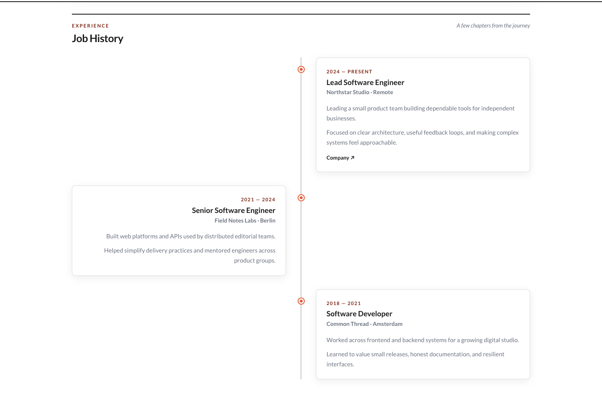
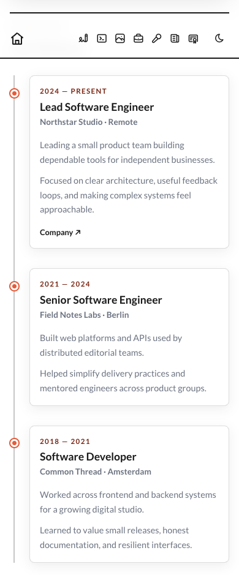

# Job History module

| Normal View                                               | Mobile View |
|-----------------------------------------------------------|-------------|
|  |             |

Tell the story of your work as a timeline rather than a dense résumé. Each role can include the details that mattered, along with links to a company, project, or piece of work.

## Add it to your site

Add `job-history` to `modules.order` in `site.config.json`, then edit `modules/job-history/content.json`:

```json
{
  "eyebrow": "Experience",
  "heading": "Job History",
  "note": "A few chapters from the journey",
  "entries": [
    {
      "period": "2024 — Present",
      "role": "Lead Software Engineer",
      "company": "Northstar Studio",
      "location": "Remote",
      "paragraphs": [
        "Leading a product team building dependable tools.",
        "Focused on clear architecture and useful feedback loops."
      ],
      "links": [
        { "label": "Company", "url": "https://example.com" }
      ]
    }
  ]
}
```

Entries appear in the order you write them; SiteKit leaves flexible period labels such as “Now”, “Summer 2024”, or “2019 — 2022” entirely up to you.

## Good to know

- Cards alternate across the center line on wide screens.
- Below 760px, the story becomes a single left-aligned column.
- The timeline decoration stays out of the accessibility tree, while each role remains a semantic article.
- Optional links are keyboard accessible and open in a new tab.
- Dark mode follows the main SiteKit theme.

## Configuration reference

| Field | What it changes |
| --- | --- |
| `eyebrow`, `heading`, `note` | The section introduction. |
| `entries` | One or more roles in display order. |
| `period` | Your own date range or period label. |
| `role`, `company`, `location` | The role heading and supporting details. |
| `paragraphs` | One or more short pieces of role description. |
| `links` | Optional labeled destinations. |
| `countOverride` | Optional text or number for the hero index. |

The module does not sort dates or create a downloadable résumé. Run SiteKit generation again after changing the content.
