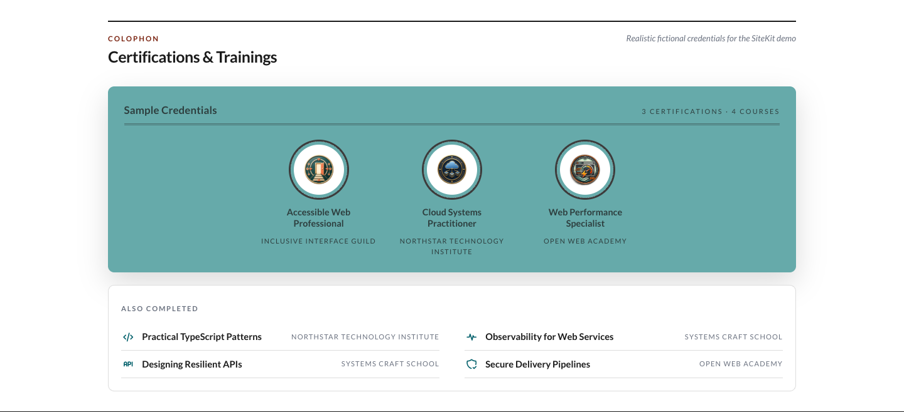

# Learning module



Celebrate the things you have learned. Important certifications get illustrated medallions, while shorter courses and achievements sit underneath as compact badges.

## Add it to your site

Add `learning` to `modules.order` in `site.config.json`, then edit `modules/learning/content.json`:

```json
{
  "eyebrow": "Colophon",
  "heading": "Certifications & Trainings",
  "note": "Courses and professional credentials",
  "panelLabel": "Certifications",
  "panelNote": "3 certifications · 4 courses",
  "miniBadgesLabel": "Also completed",
  "badges": [
    {
      "image": "badges/accessible-web.webp",
      "title": "Accessible Web Professional",
      "issuer": "Inclusive Interface Guild"
    }
  ],
  "miniBadges": [
    {
      "icon": "ti-code",
      "label": "Practical TypeScript Patterns",
      "issuer": "Systems Craft School"
    }
  ]
}
```

Put certification artwork under `modules/learning/assets/` and reference it without the `assets/` prefix. Images are fitted inside circular medallions without being cropped.

## Make the panel your own

The certification panel uses the current theme's brand color. To choose another CSS color or theme color alias, add an override in `site.config.json`:

```json
{
  "modules": {
    "overrides": {
      "learning": {
        "colors": { "trophyFill": "#66AAAA" }
      }
    }
  }
}
```

## Good to know

- Major badges show in a wide row and rearrange to three columns below 680px.
- Issuer text is tucked away on narrow screens but remains available through accessible labels and tooltips.
- Compact badges use two columns on wide screens and one below 760px.
- Mini badges use bundled Tabler names such as `ti-code`, `ti-api`, or `ti-shield-check`.
- Dark mode follows the site while preserving the chosen trophy-panel color.

Credentials currently do not have verification links or expiry dates. Their order follows `content.json`, and artwork is copied at its authored size.
