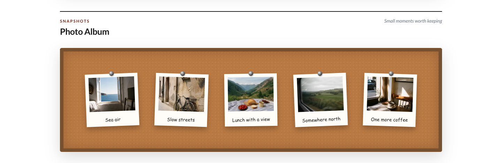
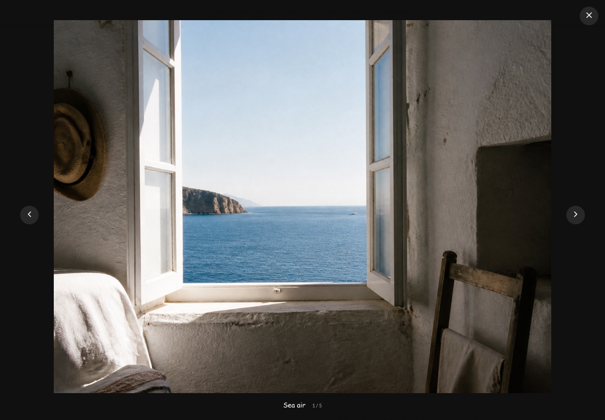
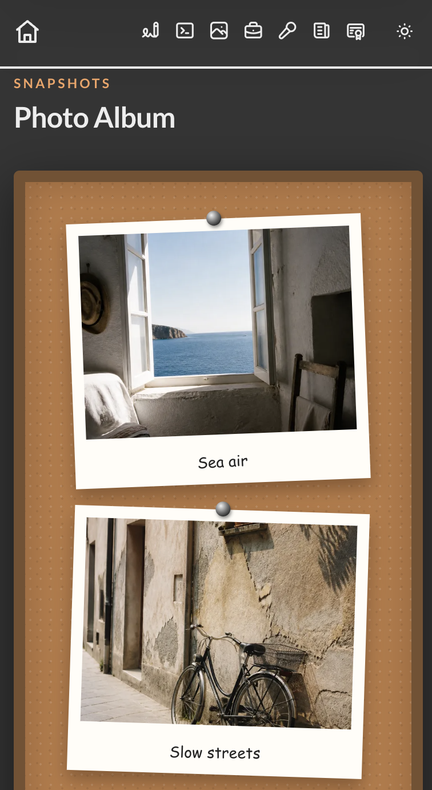

# Photo Album module


| Normal View                                               | Full-screen viewer                                                                 | Mobile View                                                                      |
|-----------------------------------------------------------|------------------------------------------------------------------------------------|----------------------------------------------------------------------------------|
|  |  |  |

Turn a handful of photographs into a playful Polaroid wall. Visitors can open every image in a full-screen, keyboard-friendly viewer.

## Add it to your site

Add `photo-album` to `modules.order` in `site.config.json`, then edit `modules/photo-album/content.json`:

```json
{
  "eyebrow": "Snapshots",
  "heading": "Photo Album",
  "note": "Small moments worth keeping",
  "columns": 3,
  "photos": [
    {
      "file": "photos/coastal-window.jpg",
      "label": "Sea air",
      "alt": "An open coastal window looking toward a calm blue sea"
    }
  ]
}
```

Put the original PNG, JPG, or JPEG files in `modules/photo-album/assets/photos/`. Reference them without the `assets/` part of the path.

## What SiteKit does for you

During generation, SiteKit creates smaller WebP previews for the board and keeps each original for the full-screen viewer. Smaller originals are never enlarged.

Choose between one and five desktop columns. The board changes to two columns below 760px and one below 480px, while dark mode follows the rest of the site.

The viewer supports previous and next buttons, Left and Right arrow keys, Escape, backdrop clicks, and returning focus to the photograph that opened it.

## Configuration reference

| Field | What it changes |
| --- | --- |
| `eyebrow`, `heading`, `note` | The section introduction. |
| `columns` | Desktop column count, from 1 to 5. |
| `photos` | Photographs in their display order. |
| `file` | Image path relative to the module's `assets/` folder. |
| `label` | Caption shown on the Polaroid and in the viewer. |
| `alt` | Required description of the photograph. |
| `countOverride` | Optional text or number for the hero index. |

Keep only originals in the module's photo folder; the generated root `assets/` directory is rebuilt for you. Touch-swipe navigation and incremental preview caching are not currently included.
