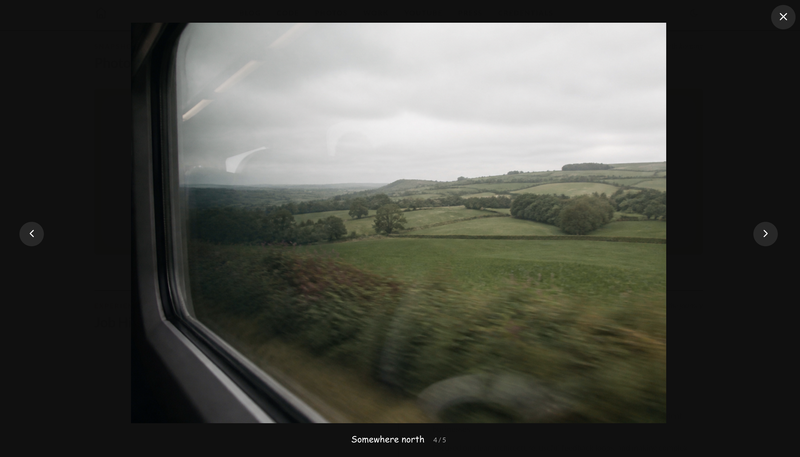

# Photo Album module



The Photo Album module displays photographs on a responsive Polaroid-style board. Selecting a photograph opens its original image in a full-screen viewer with previous and next controls.

## Features

- Configurable desktop grid with one to five columns.
- PNG, JPG, and JPEG source images.
- Responsive WebP previews generated automatically with Sharp.
- Original high-resolution files retained for the full-screen viewer.
- Captions, required alternative text, keyboard navigation, and focus restoration.
- Responsive two-column and one-column mobile layouts.

## Enable the module

Add `photo-album` to `modules.order` in `site.config.json`. Its array position controls where it appears on the page and in the header navigation.

```json
{
  "modules": {
    "order": ["blog", "photo-album", "job-history"],
    "overrides": {}
  }
}
```

## Configuration

Edit `modules/photo-album/content.json`:

```json
{
  "eyebrow": "Snapshots",
  "heading": "Photo Album",
  "note": "Small moments worth keeping",
  "columns": 3,
  "photos": [
    {
      "file": "photos/coastal-window.jpg",
      "label": "Sea air",
      "alt": "An open coastal window looking toward a calm blue sea"
    },
    {
      "file": "photos/train-window.png",
      "label": "Somewhere north",
      "alt": "Countryside passing by outside a train window"
    }
  ]
}
```

| Field | Description |
| --- | --- |
| `eyebrow` | Small label displayed above the section heading. |
| `heading` | Main section heading. |
| `note` | Optional note displayed beside the heading. |
| `countOverride` | Optional value used instead of the derived photo count. |
| `columns` | Desktop column count from 1 through 5. |
| `photos` | Ordered array of photographs; at least one is required. |
| `file` | Image path relative to `modules/photo-album/assets/`. |
| `label` | Caption displayed below the photograph and in the viewer. |
| `alt` | Required alternative text describing the photograph. |

## Originals and generated previews

Store source images directly under the module's `assets/photos/` directory:

```text
modules/photo-album/assets/photos/
  coastal-window.jpg
  train-window.png
```

The module accepts lowercase `.png`, `.jpg`, and `.jpeg` originals. Nested folders below `photos/` and other image formats are not supported.

Running `npm run generate` creates responsive WebP previews below `assets/photo-album/previews/`. Preview widths depend on the configured desktop column count, and smaller originals are not enlarged. The authored original is also copied to the generated site for the full-screen viewer.

Keep only original images under `modules/photo-album/assets/photos/`; the generated root `assets/` directory should not be edited by hand.

## Responsive and viewer behavior

The configured `columns` value controls the wide-screen board. Below 760px the board uses two columns, and below 480px it uses one column regardless of the desktop setting. Dark mode follows the global SiteKit theme without module-specific configuration.

Every Polaroid is a button. The viewer supports:

- Previous and next buttons.
- Left and Right arrow keys.
- Escape or the close button to exit.
- Clicking the backdrop to close.
- Returning focus to the photograph that opened the viewer.

## Known limitations

- Images and captions are ordered manually in `content.json`.
- The viewer does not currently support touch-swipe navigation.
- Original files can be large because the viewer deliberately loads the authored image.
- SiteKit generates previews during every generation instead of maintaining an incremental image cache.
