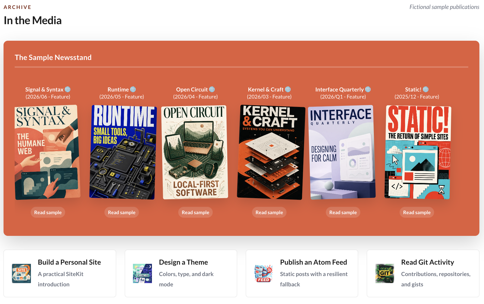

# Press module



The Press module presents publications, magazine appearances, downloadable articles, and related tutorials. Content is authored locally and rendered into the generated page without runtime JavaScript or remote data loading.

## Features

- Horizontally scrollable publication shelf with local cover images.
- Single actions for reading or downloading one resource.
- Native download menus for publications available in several languages or formats.
- Optional square-cover treatment for discs and other non-magazine artwork.
- Responsive tutorial cards below the publication shelf.
- External URLs and module-relative downloads can be used together.

## Enable the module

Add `press` to `modules.order` in `site.config.json`. Its array position controls where the section appears on the page and in the header navigation.

```json
{
  "modules": {
    "order": ["blog", "press", "learning"],
    "overrides": {}
  }
}
```

## Configuration

Edit `modules/press/content.json`:

```json
{
  "eyebrow": "Archive",
  "heading": "In the Media",
  "note": "Articles, interviews, and tutorials",
  "panelLabel": "Publication Archive",
  "countOverride": "100+",
  "magazines": [
    {
      "title": "Linux Magazine",
      "flag": "🇬🇧",
      "dateLabel": "2007/06",
      "role": "Author",
      "coverImage": "magazines/linux-magazine.webp",
      "action": {
        "type": "dropdown",
        "items": [
          { "label": "English PDF", "href": "downloads/article-en.pdf" },
          { "label": "Italian PDF", "href": "downloads/article-it.pdf" }
        ]
      }
    }
  ],
  "tutorials": [
    {
      "title": "Build a Personal Site",
      "note": "A practical introduction",
      "href": "https://example.com/tutorial",
      "image": "tutorials/build-site.webp"
    }
  ]
}
```

## Publication fields

| Field | Description |
| --- | --- |
| `title` | Publication or article title. |
| `flag` | Flag emoji or another short marker shown beside the title. |
| `dateLabel` | Authored date or issue label, such as `2007/06`. |
| `role` | Your relationship to the publication, such as `Author` or `Contributor`. |
| `coverImage` | Cover path relative to `modules/press/assets/`. |
| `coverSquare` | Optional square-cover presentation without the paper-style shadow. |
| `action` | A `single` link or a `dropdown` containing at least two links. |

A single action uses `type`, `label`, and `href`:

```json
{
  "action": {
    "type": "single",
    "label": "Read article",
    "href": "https://example.com/article"
  }
}
```

Selecting a cover opens the single action or the first item in its dropdown.

## Assets and tutorials

Store publication covers, tutorial images, and downloads under the module's `assets/` directory:

```text
modules/press/assets/
  magazines/
    linux-magazine.webp
  tutorials/
    build-site.webp
  downloads/
    article-en.pdf
```

`coverImage` and tutorial `image` must be module-relative asset paths. Publication actions and tutorial `href` values may be external URLs or module-relative files.

Tutorial entries require `title`, `note`, `href`, and `image`. The `tutorialsLabel` configuration field is currently reserved but is not displayed by the template.

## Responsive and accessible behavior

The publication shelf scrolls horizontally instead of compressing its covers. Tutorial cards use four columns on wide screens, two below 1024px, and one below 600px. Dark mode follows the global SiteKit theme without module-specific configuration.

Publication covers and tutorial cards are ordinary links. Multi-download actions use native `<details>` and `<summary>` controls, so they remain keyboard accessible without JavaScript.

## Known limitations

- Content is static and changes only when the site is generated again.
- Cover and tutorial images are copied as authored; SiteKit does not resize them.
- Dropdown actions always display the label `Download`.
- The first dropdown item is always used as the publication cover's destination.
