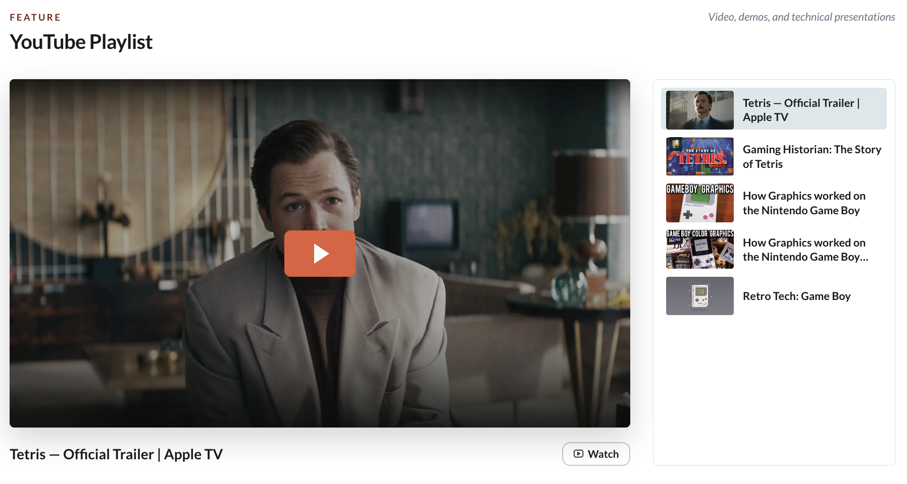

# YouTube module



The YouTube module adds a playlist-style section for videos, demos, talks, and related resources. The playlist is authored in `content.json`; it is not imported automatically from a YouTube playlist.

## Features

- YouTube videos play inline after the visitor selects the cover.
- Non-YouTube entries can link to an external page instead.
- Local stage covers and smaller playlist thumbnails are supported.
- When a YouTube cover is omitted, SiteKit tries several YouTube-hosted WebP and JPEG thumbnail sizes.
- Optional action buttons can link to downloads, podcasts, articles, or other resources.
- On smaller screens, the right-hand playlist becomes a horizontal scrolling strip below the player.

## Enable the module

Add `youtube` to `modules.order` in `site.config.json`. Its position in the array controls its position on the page and in the header navigation.

```json
{
  "modules": {
    "order": ["blog", "youtube", "photo-album"],
    "overrides": {}
  }
}
```

## Configuration

Edit `modules/youtube/content.json`:

```json
{
  "eyebrow": "Feature",
  "heading": "YouTube Playlist",
  "note": "Videos, demos, and technical presentations",
  "youtube": [
    {
      "title": "How Graphics Worked on the Nintendo Game Boy",
      "videoId": "zQE1K074v3s",
      "img": "covers/gameboy.big.png",
      "thumb": "covers/gameboy.small.avif",
      "actions": [
        {
          "label": "Podcast",
          "href": "https://player.fm/series/example"
        }
      ]
    }
  ]
}
```

| Field | Description |
| --- | --- |
| `eyebrow` | Small label displayed above the section heading. |
| `heading` | Main section heading. |
| `note` | Optional note displayed beside the heading. |
| `countOverride` | Optional value used instead of the derived playlist count. |
| `youtube` | Ordered array of playlist entries. |
| `title` | Required entry title. |
| `videoId` | YouTube video ID used for the cover and click-to-play embed. |
| `href` | External or module-relative destination for a non-YouTube entry. Use this instead of `videoId`. |
| `img` | Optional stage-cover path relative to `modules/youtube/assets/`. |
| `thumb` | Optional playlist-thumbnail path relative to `modules/youtube/assets/`. |
| `actions` | Optional links displayed below the selected entry. |

Each entry should provide either `videoId` or `href`. When both are present, the YouTube `videoId` behavior takes precedence.

## Covers and downloads

Store local files under the module's `assets/` directory:

```text
modules/youtube/assets/
  covers/
    gameboy.big.png
    gameboy.small.avif
  downloads/
    presentation.pdf
```

Reference those files without the `assets/` prefix:

```json
{
  "img": "covers/gameboy.big.png",
  "actions": [
    { "label": "Download", "href": "downloads/presentation.pdf" }
  ]
}
```

Cover and thumbnail files should use browser-supported image formats such as WebP, JPEG, PNG, or AVIF. Action links may use either external URLs or module-relative asset paths.

## Runtime and responsive behavior

SiteKit embeds the authored playlist data in the generated page. A YouTube iframe is created only after the visitor activates a video, avoiding an initial YouTube embed request. If no local cover is configured, thumbnail images are loaded from `i.ytimg.com` and therefore require network access.

The video cover can be activated with a pointer, Enter, or Space. At widths below 820px, playlist entries move below the player into a horizontally scrollable rail. Below 600px, action labels collapse to icons. Dark mode follows the site's global theme without module-specific configuration.

## Known limitations

- The module does not fetch or synchronize a YouTube playlist automatically.
- YouTube-hosted covers and video playback require access to YouTube.
- SiteKit does not provide a consent or privacy overlay for the YouTube iframe.
- Local cover images are copied as authored; they are not resized during generation.
