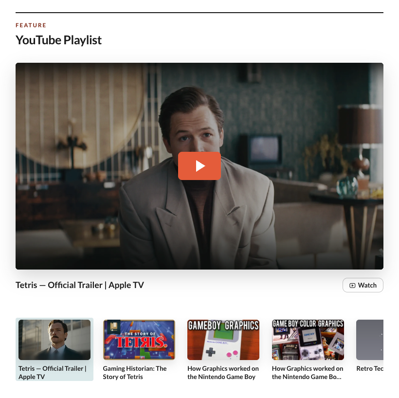

# YouTube module

| Normal View                                                        | Mobile View                                                                           |
|--------------------------------------------------------------------|---------------------------------------------------------------------------------------|
|  |  |

Collect talks, demos, interviews, or favorite videos in one focused playlist. You choose every entry, so the section can mix YouTube videos with links to recordings hosted elsewhere.

## Add it to your site

Add `youtube` to `modules.order` in `site.config.json`, then edit `modules/youtube/content.json`:

```json
{
  "eyebrow": "Feature",
  "heading": "YouTube Playlist",
  "note": "Videos, demos, and technical presentations",
  "youtube": [
    {
      "title": "How Graphics Worked on the Nintendo Game Boy",
      "videoId": "zQE1K074v3s",
      "img": "covers/gameboy.big.png",
      "thumb": "covers/gameboy.small.avif",
      "actions": [
        { "label": "Podcast", "href": "https://player.fm/series/example" }
      ]
    }
  ]
}
```

Use `videoId` for a YouTube video or `href` for a non-YouTube destination. If both are present, the YouTube video wins.

## Covers and related links

Put local images and downloads under `modules/youtube/assets/`, then reference them without the `assets/` prefix. WebP, JPEG, PNG, and AVIF all work well.

`img` is the large player cover and `thumb` is the smaller playlist image. When you omit them for a YouTube entry, SiteKit tries YouTube's hosted thumbnails. `actions` can point to a download, podcast, article, channel, or anything else that belongs with the selected video.

## Good to know

- YouTube playback starts only after a visitor selects a video, avoiding an iframe request on the initial page load.
- The cover works with a pointer, Enter, or Space.
- Below 820px, the playlist becomes a horizontal rail beneath the player. Below 600px, action labels become icons.
- Dark mode follows the main SiteKit theme.
- SiteKit does not import or synchronize a YouTube playlist; the order is yours.

YouTube-hosted covers and playback need network access. The module does not currently add a consent overlay, and local covers are copied at their original size.
